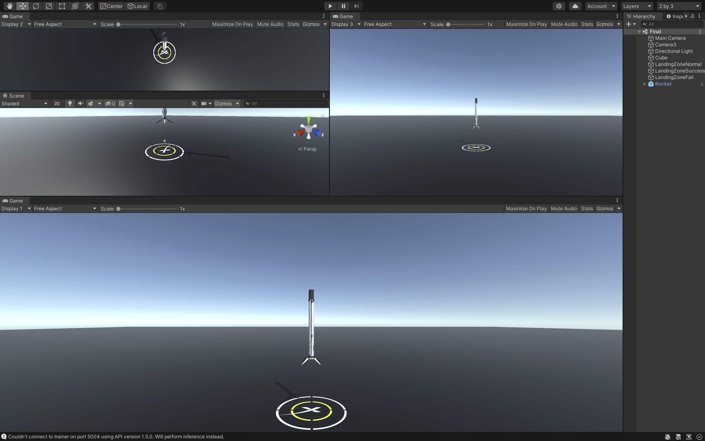

# Rocket-Landing
### 기술
##### PPO Pytorch  후 보상체계  실시간 보상체계  커리큘럼 학습  강화학습  내적, 벡터

### 보상체계
월드좌표와 로컬좌표의 내적을 구한 값이 0에 가까워질 수 록 실시간으로 보상.

### 시각화
y좌표(높이)가 20 이하인 경우 로켓 4개으 다리를 서서히 피는 시각화
엔진에 파티클 시스템을 도입하여 불꽃 시각화
목표 지점에 노멀(기본), 성공(초록), 실패(빨강) 바닥을 겹친 후 결과가 없을 때는 노멀, 착륙에 성공하면 초록, 실패하면 빨강
팔콘의 Assest을 구해 적용시킴

### 1차원 로켓 학습 결과
활용 : y축, 커리큘럼 학습, 후 보상, 다중 학습
에피소드 : 1만번
시간 : 1시간
보상 : 100/100
### 2차원 로켓 학습 결과

활용 : y축, x축, 커리큘럼 학습, 후 보상, 다중 학습, 좌우 회전 
에피소드 : 4만번
시간 : 2시간
보상 : 100/100


### 3차원 로켓 학습 결과
활용 : y축, x축, z축, 커리큘럼 학습, 후 보상, 다중 학습, 앞뒤좌우 회전 
에피소드 : 10만번
시간 : 3시간
보상 : 100/100

### 개발 환경 세팅

### 3차원  실시간 보상 로켓 학습 결과
활용 : y축, x축, z축, 반지름 50의 랜덤 생성, 실시간 보상, 다중 학습, -45~45의 랜덤 회전, 높이 150m, ppo알고이름
에피소드 : 2억번
시간 : 4일
보상 : 86/100

### 느낀점
ppo알고리즘을 사용하여 기존 데이터를 활용하여 학습에 큰 도움을 주긴 하였지만 언제나 성장을 했을때 기존 데이터가 쓸모가 있어진다
후 보상체계도 좋았지만 실시간으로 보상을 주는 방법을 떠올린 것이 신의 한수 였다. 물리엔진 말고 기압, 온도, 풍력, 날씨, 계절 등을 도입해 다양한 테스트를 할 예정
# 영상(Viode)

# [Link](https://www.youtube.com/watch?v=XtoOrVzBbbQ)

### 파라미터
##### config2.txt
<pre><code>behaviors:
  My Behavior:
    trainer_type: ppo
    hyperparameters:
      batch_size: 2048
      buffer_size: 20480
      learning_rate: 0.0003
      beta: 0.005
      epsilon: 0.2
      lambd: 0.95
      num_epoch: 3
      learning_rate_schedule: linear
    network_settings:
      normalize: true
      hidden_units: 512
      num_layers: 3
      vis_encode_type: simple
    reward_signals:
      extrinsic:
        gamma: 0.995
        strength: 1.0
    keep_checkpoints: 10000
    max_steps: 1000000000
    time_horizon: 1000
    summary_freq: 30000
</code></pre>

### 학습방법
##### [ML-Agents Config]
<pre><code>conda activate [가상환경이름]-env
cd {SpaceX Landing 프로젝트 폴더 경로}\Assets
mlagents-learn config/config2.txt --run-id=[이름 생성]
mlagents-learn config/config2.txt --run-id=[이름 생성] --resume   <- 이어학습(학습 종료후 종료 시점부터 이어서 학습)</code></pre>
##### [ML-Agents 결과물]
<pre><code>conda activate [가상환경이름]-env
cd {SpaceX Landing 프로젝트 폴더 경로}\Assets
tensorboard --logdir=./results</code></pre>


## Unity 파일구조
```
Rocket-Landing
|---- Assets
|     |---- AtomRocket -> 로켓 에셋(무료)
|     |     |---- Demo
|     |     |---- Mesh
|     |     |---- Prefab
|     |---- Demo
|     |     |---- Materials -> 로켓 착륙판 색깔
|     |     |---- Prefab
|     |     |---- Scripts
|     |     |     |---- AgentControllerFinalR.cs -> 에이전트컨트롤러
|     |     |     |---- RocketControllerFinalR.cs -> 로켓컨트롤러
|     |     |     |---- Camera1.cs -> 로켓 추적1
|     |     |     |---- Camera3.cs -> 로켓 추적2
|     |     |---- Final.unity -> Scene
|     |     |---- My Behavior.onnx -> 모델(마지막 모댈)
|     |---- Final
|     |---- Lab
|     |---- ML-Agents
|     |---- Models
|     |---- Quiz
|     |---- Scenes -> 씬
|     |---- configs -> 파라미터
|     |---- results -> 학습된 모델
|---- Packages
|---- ProjectSettings
```
# report [Link](https://docs.google.com/document/d/1wvJgfdiplu9KBd0RmszDFPmp2Y5kYz2s1mIfXryPQIc/edit?usp=sharing)
